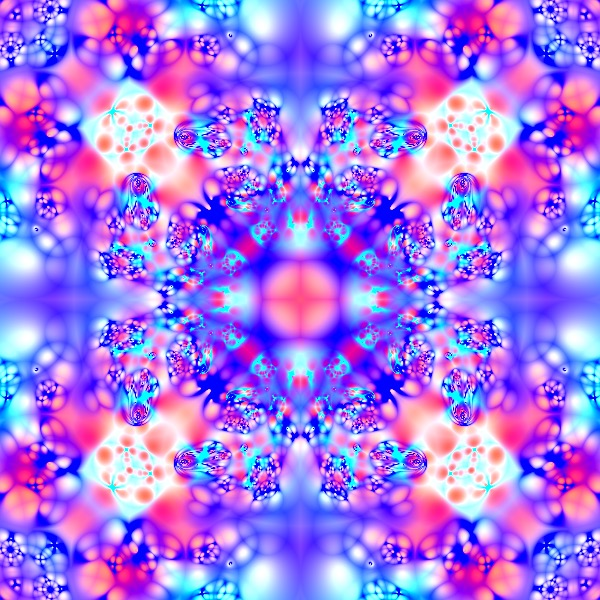

# Generative fractals in p5.js with LYGIA

## The starting point for the fractal code is this [sketch](https://www.shadertoy.com/view/ctByWz). I created a stand-alone function, with options for speed of animation, level of zoom, and number of iterations. Using greater numbers for zoom and iterations lead to very detailed images. I called the fractal function twice with two different sets of parameters and colors to create the images below.

## I am using [LYGIA](https://github.com/patriciogonzalezvivo/lygia)'s built-in color functions add color.

<!-- IMAGE-LIST:START - Do not remove or modify this section -->
<!-- prettier-ignore-start -->
<!-- markdownlint-disable -->
<table>
  <tbody>
    <tr>
      <td align="center"><a href="https://editor.p5js.org/kfahn/sketches/sLtJxaZXQ">  <b>"Tie Dye" Fractal </b>p5 sketch</a></td>
     <td align="center"><a href="https://editor.p5js.org/kfahn/sketches/I29DSDQOS">  <b>Generative Fractal </b>p5 sketch</a></td>
    </tr>
  </tbody>
</table>

<!-- markdownlint-restore -->
<!-- prettier-ignore-end -->

<!-- IMAGE-LIST:END -->
