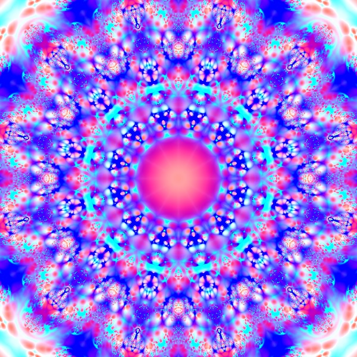
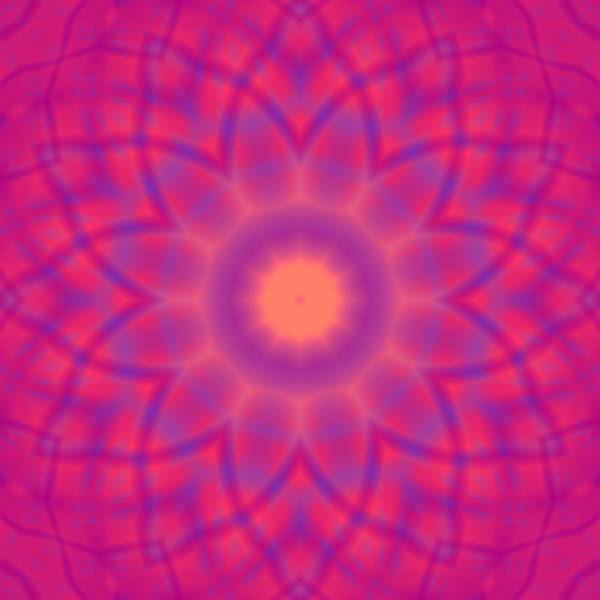
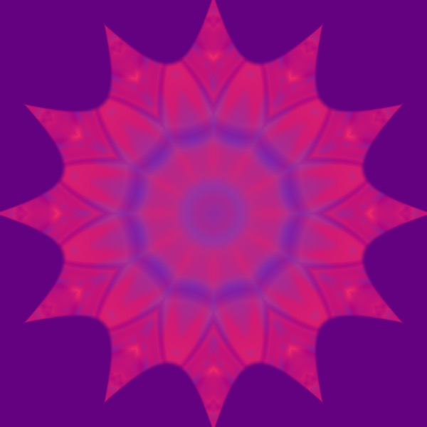

# Generative Kaleidoscope in p5.js with LYGIA

## The inspiration for the code is this [sketch](https://www.shadertoy.com/view/ctByWz). The kaleidoscope function has options for speed of animation, level of zoom, and number of iterations, and two parameters that provide additional control. The first row shows the "kaleidoscope" look--use m = 1.75, n = 1.15. These images remind me of what you might see looking through a traditional kaleidoscope. The second row shows a "tie-dye" look--use m = 1.5, n = 1.3. In the fourth image I am using the color as a texture for the supershapeSDF, which can be found on LYGIA.

## Notes about usage

- Using greater numbers for zoom and iterations lead to more detailed colors.
- You can call the function twice with two different sets of parameters and colors to create a more complex color.
- Darker colors are better when layering.

## I am using [LYGIA](https://github.com/patriciogonzalezvivo/lygia)'s built-in color functions add color.

<!-- IMAGE-LIST:START - Do not remove or modify this section -->
<!-- prettier-ignore-start -->
<!-- markdownlint-disable -->
<table>
  <tbody>
  <tr>
      <td align="center"><a href="https://editor.p5js.org/kfahn/sketches/I29DSDQOS">  <b>Two Color Kaleidoscope </b>p5 sketch</a></td>
     <td align="center"><a href="">  <b>Four Color Kaleidescope </b>p5 sketch</a></td>
    </tr>
    <tr>
      <td align="center"><a href="">  <b>Two Color Tie Dye </b>p5 sketch</a></td>
     <td align="center"><a href="">  <b>Four Colors Filling Shape </b>p5 sketch</a></td>
    </tr>
  </tbody>
</table>

<!-- markdownlint-restore -->
<!-- prettier-ignore-end -->

<!-- IMAGE-LIST:END -->
